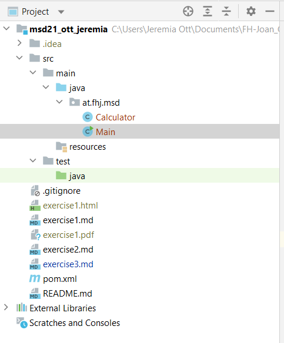
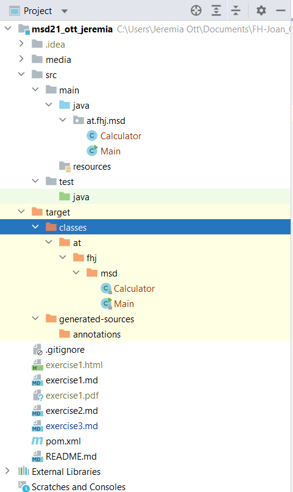
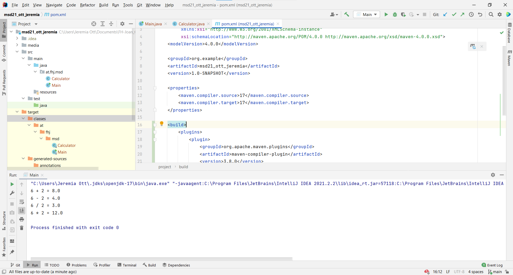

# Exercise workflow

## Calculator
Create Calculator class in a new package "at.fhj.msd".
Also Implement the class with the four mathe operators

## The Main class
Create a Main class with the main methode.
Use the Calculator class to implement the main methode.

## First run

### Before first run:

### After first run:
   
Like you can see a new folder was created by maven.

## Run again
Do a litle bit of maven things. After that I made a screenshot of running the main methode.

