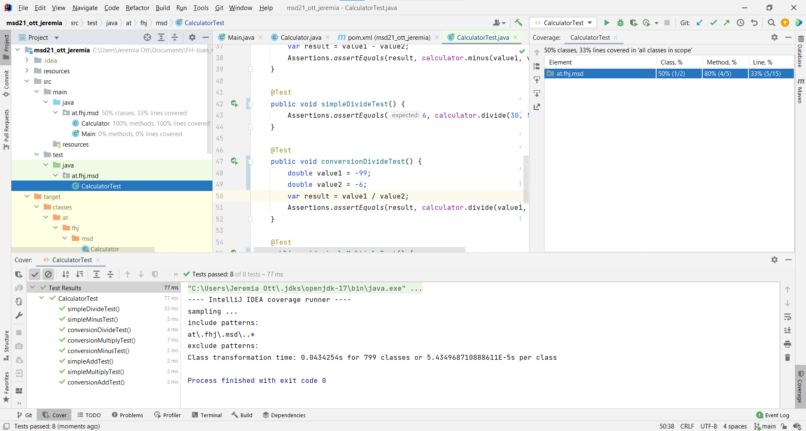

# Exercise workflow

## Calculator tests
For every methode of Calculator the there is a one simple test and one that tests conversion.

### Test cases
#### add
15 + 5 = 20   
3 + (-5) = -2
#### minus
13 - 20 = -7   
1 - (-20) = 21
#### divide
30 / 5 = 6   
(-99) * (-6) = 15,5
#### multiply
1 * 2 = 2   
(-11) * (-7) = 77

### Test coverage

